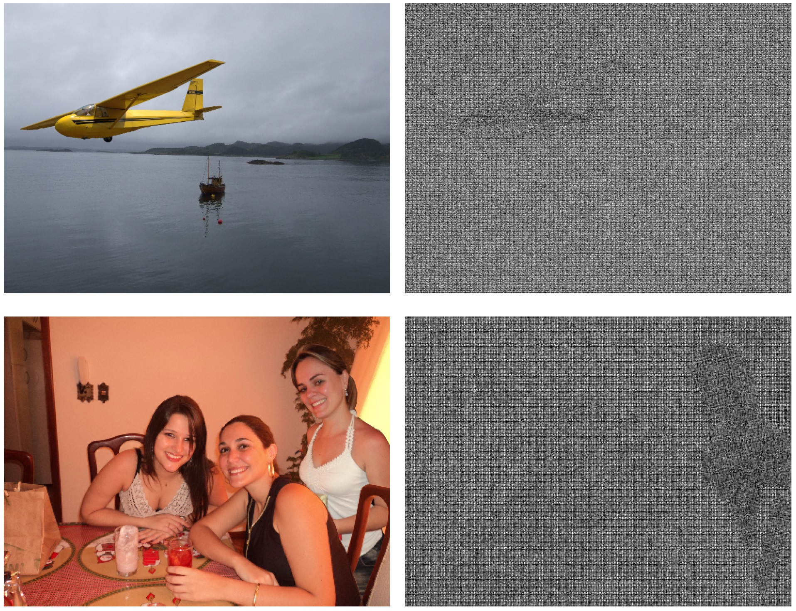

Forensic analyses of digital images rely heavily on the traces of in-camera and out-camera processes left on the acquired images.
Such traces represent a sort of camera fingerprint.
If one is able to recover them, by suppressing the high-level scene content and other disturbances, a number of forensic tasks
can be easily accomplished. A notable example is the PRNU pattern, which can be regarded as a device fingerprint, and has received great attention in multimedia forensics.
In this paper we propose a method to extract a camera model fingerprint, called noiseprint, where the scene content is largely suppressed and model-related artifacts are enhanced.
This is obtained by means of a Siamese network, which is trained with pairs of image patches coming from the same (label +1) or different (label −1) cameras.
Although noiseprints can be used for a large variety of forensic tasks, here we focus on image forgery localization.
Experiments on several datasets widespread in the forensic community show noiseprint-based methods to provide state-of-the-art performance.

### News

*   2018-08-25: Paper available on Arxiv.
*   2019-04-15: Code available online.


### Bibtex

```js
@article{Cozzolino2018_Noiseprint,
  title={Noiseprint: a CNN-based camera model fingerprint},
  author={D. Cozzolino and L. Verdoliva},
  journal={arXiv preprint arXiv:1808.08396},
  year={2018}
} 
```

